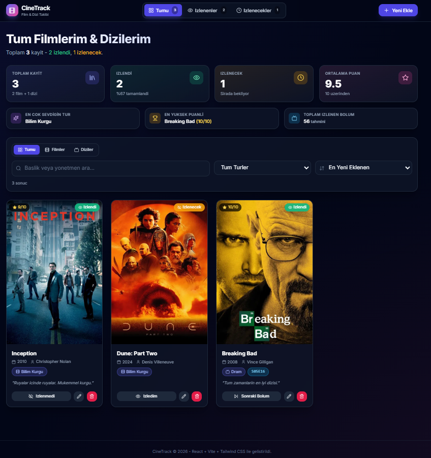

# CineTrack

İzlediğim ve izleyeceğim film/dizileri tek yerden takip ettiğim bir web uygulaması. Puan veriyorum, not düşüyorum, dizilerde hangi bölümde kaldığımı kaydediyorum. Veriler tarayıcıda (LocalStorage) tutuluyor, backend yok.

**Canlı demo:** https://cinetrack-enes.netlify.app/

## Ekran Görüntüsü



## Özellikler

- Film ve dizi ekleme, düzenleme, silme (CRUD)
- İzlendi / izlenecek listeleri, tek tıkla durum değiştirme
- Film ve dizi ayrımı; dizilerde sezon/bölüm takibi (S05E16 gibi)
- Dizi kartlarında "Sonraki Bölüm" butonu
- Arama, tür filtresi, film/dizi filtresi, sıralama
- 0–10 arası puanlama ve kişisel not alanı
- Anasayfada istatistik kartları (toplam, ortalama puan, en sevilen tür, en yüksek puanlı yapım vb.)
- Silme öncesi onay penceresi; silindikten sonra geri alma
- Toast bildirimleri (ekleme, güncelleme, silme)
- Karanlık tema, responsive tasarım

## Kullanılan Teknolojiler

React 18, Vite, Tailwind CSS, React Router, Sonner, lucide-react, uuid, LocalStorage

## Kurulum

```bash
npm install
npm run dev
```

Tarayıcıda http://localhost:5173 adresinden açılır.

Production build:

```bash
npm run build
```

## Klasör Yapısı

```
src/
├── components/     Navbar, MovieCard, MovieForm, FilterBar, StatsDashboard vb.
├── pages/          HomePage, WatchedPage, ToWatchPage, AddEditPage
├── interfaces/     Movie veri modeli ve validasyon
├── hooks/          useLocalStorage, useMovies, useStats
├── App.jsx
└── main.jsx
```
